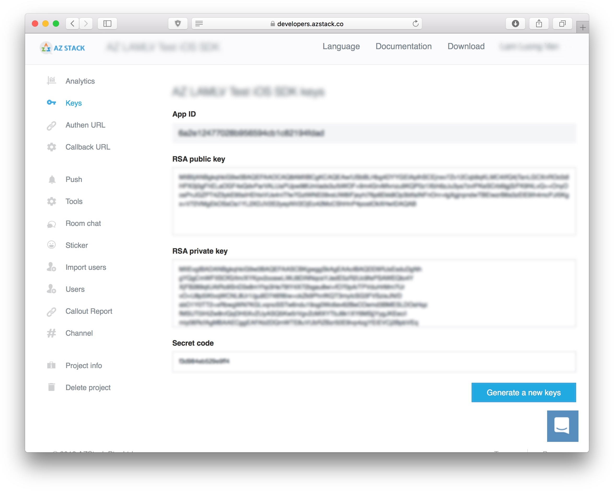

   

AzCall is the Communication SDK for [AzStack](http://azstack.com) with video/audio WebRTC call and GSM call. 

This is Swift version. You can find obj-c version [here](https://developers.azstack.co/SDK/iOS)

## Requirements

* Xcode 9.0 and above
* Swift 4.0
* AzCall has WebRTC dependency, it's has no bitcode enable. So you have to change bitcode enable to NO to work with AzCall.

## Installation

Rx doesn't contain any external dependencies.

These are currently the supported options:

### [CocoaPods](https://guides.cocoapods.org/using/using-cocoapods.html)

**Tested with `pod --version`: `1.5.3`**

```ruby
# Podfile
source 'https://github.com/CocoaPods/Specs.git'

platform :ios, '9.0'
use_frameworks!
inhibit_all_warnings!

target 'YOUR_TARGET_NAME' do
	pod 'AzCall'
end


post_install do |installer|
    installer.pods_project.targets.each do |target|
        target.build_configurations.each do |config|
            config.build_settings['ENABLE_BITCODE'] = 'NO'
        end
    end
end


```

Replace `YOUR_TARGET_NAME` and then, in the `Podfile` directory, type:

```bash
$ pod install
```

Then import in your project

```swift
import AzCall // that's all

```


### [Carthage](https://github.com/Carthage/Carthage)

```swift
// Not availabe yet, this will be coming soon.
```

## Usage

### Register AppId with AzStack:

1. Create your account on [AzStack.com](https://developers.azstack.co/signin)
2. Create your project. On successful, we have something like this:

 

Save AppId and public key, they will be using in mobile client.

----

### SDK Initialization

Initialize SDK in `application(_:didFinishLaunchingWithOptions:)`:

```swift
import AzCore
import AzCall

func application(
	_ application: UIApplication,
	didFinishLaunchingWithOptions launchOptions: [UIApplicationLaunchOptionsKey: Any]?
) -> Bool {
        
	AzStackManager.shared.appId = <#YOUR_APP_ID#>
	AzStackManager.shared.publicKey = <#YOUR_PUBLIC_KEY#>
	
	/*
	 At this time, AzStack has Android SDK, Web SDK and React-Native SDK.
	 Some of browser do not support Unified Plan SDP Semantics.
	 So we have to use .planB 
	 */
	AzCallManager.shared.settings.sdpSemantics = .planB

	return true
}

```

By default, AzStack SDK has 4 log level:

```swift
enum LogLevel {
	case error
	case warn
	case info
	case debug
}
```

If your don't want to see these logs, change AzStack SDK logLevel:

```swift
AzStackManager.shared.logLevels = [.error, .info, .debug, .warn]
```

----

### Share push notification with AzStack

```swift
func application(
	_ application: UIApplication, 
	didRegisterForRemoteNotificationsWithDeviceToken deviceToken: Data
) {
	AzCallManager.shared.pushHandler.application(application, didRegisterWith: deviceToken)
	
	// TODO: your code here
	
}

func application(
	_ application: UIApplication, 
	didReceiveRemoteNotification userInfo: [AnyHashable: Any]
) {
	AzCallManager.shared.pushHandler.application(application, didReceive: userInfo)
	
	// TODO: your code here
	
}
```

### Initialize Authentication With AzServer

We need some parameters:

- userId: *IT'S NOT YOUR USER_ID*. It's your unique string for AzStack identify.
- userCredentials: *AzStack server will forward this to your server*. userCredentials can be a password, token to verify your account.
- fullname: displayed on push notification, incoming call
- additionInfo: for addtional requirement. AzStack server do nothing with it, just forward to your server.
- completion: callback with connecting result


```swift
AzStackManager.shared.connectWithAzStack(
    userId: <# YOUR_AZ_USER_ID #>,
    userCredentials: <# YOUR_CREDENTIALS #>,
    fullname: <# FULL NAME #>,
    additionInfo: <#[String: Any]?#>,
    completion: { result in
        if let err = result.error {
            print(err)
        } else {
            print(result.userId ?? "")
            // Ready to work with AzCall
        }

        // TODO: your code here
    }
)
```

### Make a free call

AzCall has 2 free call types:

- Audio Call
- Video Call

Parameters:

- YOUR-PARTNER-AZ-USER-ID: partner AzUserId
- hasVideo: AudioCall = false, VideoCall = true

```swift
AzCallManager.shared.startRtcCallWith(
    <#YOUR_PARTNER_AZ_USER_ID#>,
    hasVideo: <#Bool#>,
    animatedPresent: false,
    completionPresent: nil
)
```

### Make a GSM call

For GSM call, you need some specific requiments. Please contact with: [info@azstack.co](mailto:info@azstack.co)

On client, we have very easy way to start a GSM call with 1 line of code:

```swift
AzCallManager.shared.showFreeSwitchCall(true, completionPresent: nil)
```

## TODO:

- Unit test
- UI-Test
- Localization. At this moment, AzCall using a setting language to show. You can view/modify it via `AzCallMessage`

## Support, Bugs, Issue

Feel free to submit bugs, issues, or your features [HERE](https://github.com/AZStackPteLtd/AzCall/issues)

Or contact us: [info@azstack.co](mailto:info@azstack.co)

For more informations, please visit our website: [AzStack.Com](https://azstack.com)
